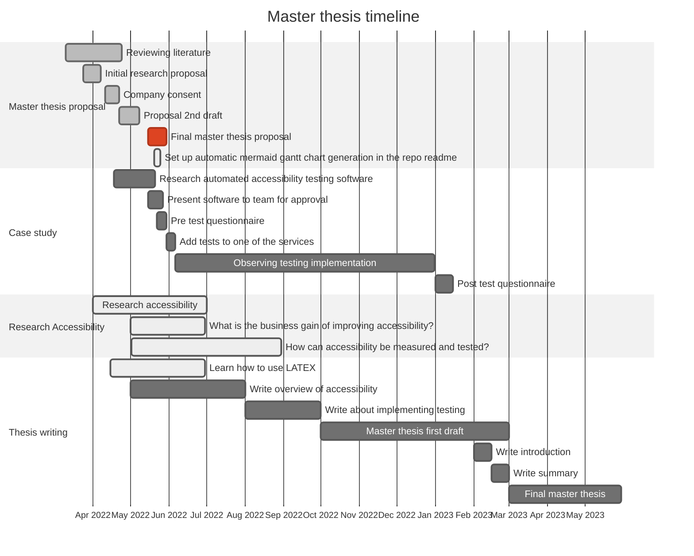

# Timeline for HCI master thesis

```mermaid
%%{init: {'theme': 'neutral'}}%%
gantt
dateFormat YYYY-MM-DD
axisFormat  %b %Y
title Master thesis timeline

section Master thesis proposal
Reviewing literature :done,  I_kwDOHN4WtM5IPt0e, 2022-03-10,  2022-04-24
Initial research proposal :done,  I_kwDOHN4WtM5IPQAc, 2022-03-24,  2022-04-07
Company consent :done,  I_kwDOHN4WtM5IPjR4, 2022-04-11,  2022-04-22
Proposal 2nd draft :done,  I_kwDOHN4WtM5IPQdj, 2022-04-22,  2022-05-08
Final master thesis proposal :crit,  I_kwDOHN4WtM5IO6RY, 2022-05-15,  2022-05-30
Set up automatic mermaid gantt chart generation in the repo readme :active,  I_kwDOHN4WtM5KFnVy, 2022-05-20,  2022-05-25

section Case study
Research automated accessibility testing software : I_kwDOHN4WtM5IPCPt, 2022-04-18,  2022-05-21
Present software to team for approval : I_kwDOHN4WtM5IPKxI, 2022-05-15,  2022-05-27
Pre test questionnaire : I_kwDOHN4WtM5IPPfv, 2022-05-22,  2022-05-30
Add tests to one of the services  : I_kwDOHN4WtM5IPSTR, 2022-05-30,  2022-06-06
Observing testing implementation : I_kwDOHN4WtM5IPS6R, 2022-06-06,  2022-12-31
Post test questionnaire : I_kwDOHN4WtM5IPr5f, 2023-01-01,  2023-01-15

section Research Accessibility
Research accessibility :active,  I_kwDOHN4WtM5IP7K7, 2022-04-01,  2022-07-01
What is the business gain of improving accessibility? :active,  I_kwDOHN4WtM5Jr4kn, 2022-05-01,  2022-06-30
How can accessibility be measured and tested? :active,  I_kwDOHN4WtM5Jr4tP, 2022-05-02,  2022-08-30

section Thesis writing
Learn how to use LATEX :active,  I_kwDOHN4WtM5IPfGo, 2022-04-15,  2022-06-30
Write overview of accessibility : I_kwDOHN4WtM5IPeB8, 2022-05-01,  2022-08-01
Write about implementing testing : I_kwDOHN4WtM5IRoTT, 2022-08-01,  2022-10-01
Master thesis first draft : I_kwDOHN4WtM5IPWkC, 2022-10-01,  2023-03-01
Write introduction : I_kwDOHN4WtM5IPdl3, 2023-02-01,  2023-02-15
Write summary : I_kwDOHN4WtM5IPdrk, 2023-02-15,  2023-03-01
Final master thesis : I_kwDOHN4WtM5IPXSh, 2023-03-01,  2023-05-30
```
