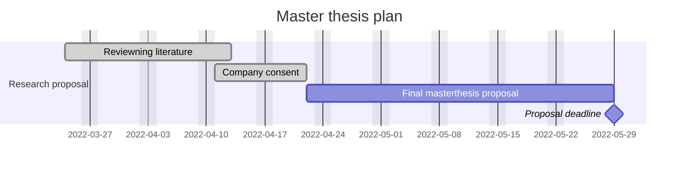

# masterThesis

```mermaid
gantt
    dateFormat  YYYY-MM-DD
    title       Master thesis plan
    excludes    weekends
    %% (`excludes` accepts specific dates in YYYY-MM-DD format, days of the week ("sunday") or "weekends", but not the word "weekdays".)

    section Research proposal
    Reviewning literature            :done,    des1, 2022-03-24, 14d
    Company consent               :done,  des2, 2022-04-11, 2022-04-22
   Final masterthesis proposal               :         des3, after des2, 2022-05-29
   Proposal deadline: milestone, m1, 2022-05-29, 2022-05-29
   

```
